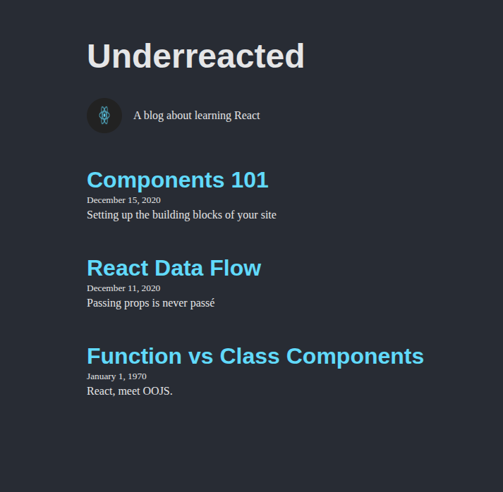

##  Component Descriptions

### App.jsx
This is the main parent component. It holds the blog data and passes it down to child components using props. It connects all other components together.

### Header.jsx
Displays the blog title using data passed from App via props. It is responsible for the top section of the page.

### About.jsx
Displays information about the blog including an image and description. It receives data through props and renders it inside an aside element.

### ArticleList.jsx
Receives an array of blog posts from App and uses the map function to dynamically render multiple Article components.

### Article.jsx
Displays individual blog post information including title, date, and preview text. It receives all data via props from ArticleList.

## Screenshots

